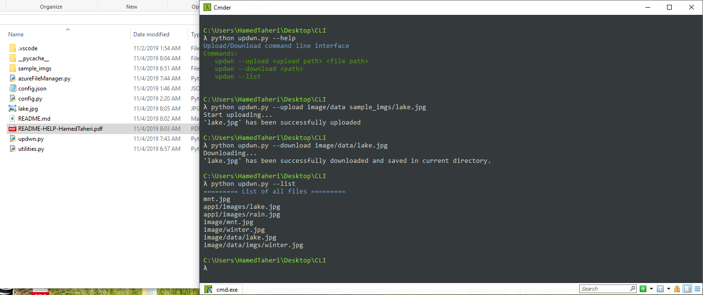

# Installation

### Step1:

> Make sure python >= 3.6  has been installed

 Install following packages using pip in terminal:
 (this package is `vital` to work this cli-app)

* `pip install azure-storage-file`

### Step2:

> Edit config.json file and put your Azure `StorageAccount` name, AccessKey->`Key1` and `FileShare`(SMB) name in it.

```json
{
  "configs": {
    "account_name": "YourAzureStorageAccountName",
    "account_key": "Key1 from AccessKey related to your StorageAccount",
    "file_share": "Name of your FileShare(Container) in StorageAccount"
  }
}

```

Links:

Azure Portal:
[https://portal.azure.com/](https://portal.azure.com/)

Microsoft Azure Storage SDK for Python:
[https://github.com/Azure/azure-storage-python](https://github.com/Azure/azure-storage-python)

How to create FileShare and StorageAccount:
[https://docs.microsoft.com/en-us/azure/storage/files/storage-how-to-create-file-share](https://docs.microsoft.com/en-us/azure/storage/files/storage-how-to-create-file-share)

Learn how to develop Python applications and services that use Azure Files to store file data.
[https://github.com/MicrosoftDocs/azure-docs/blob/master/articles/storage/files/storage-python-how-to-use-file-storage.md](https://github.com/MicrosoftDocs/azure-docs/blob/master/articles/storage/files/storage-python-how-to-use-file-storage.md)

# Usage:

Open your OS Terminal ( like CMD in windows ) inside `Project directory (CLI directory)`.

Type below command for more info and help:

> python updwn.py --help

Type below command to upload `sample_imgs/lake.jpg` to `image/data` path in azure:

> python updwn.py --upload image/data sample_imgs/lake.jpg

Type below command to download `image/data/lake.jpg` in your computer to the current directory:

> python updwn.py --download image/data/lake.jpg

Type below command to see all files list:

> python updwn.py --list

----------------------------------------------

## Screenshot




Full Stack Developer